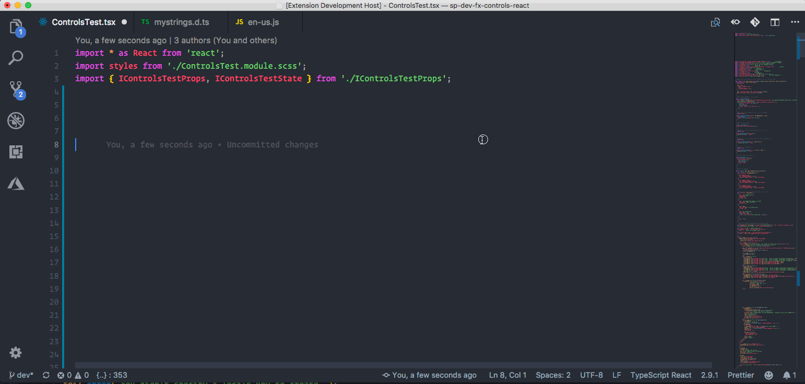
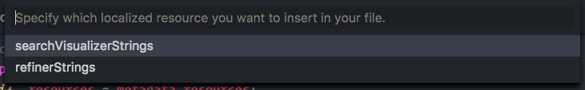

# SharePoint Framework Localization Resources Extension

This extension for Visual Studio Code adds allows you to add new resource keys to the localization files in your SharePoint Framework solutions. It can also be used to import an available localization resource to the current file.

**Importing**

**Creating new resource keys**

**What with multiple localized resources?**

When multiple localization resources are available (retrieved from the `config.json` file), it will propose you which one to import or add your keys.

Here is a sample of my `config.json` file:

## Usage

**Import resource module to the current file**

- Start by opening the command prompt:
  - Windows `⇧+ctrl+P`
  - Mac: `⇧+⌘+P`
- Type: `SPFx import localization strings module` and press `enter`
- Select the localized resource to import (if multiple are available, otherwise it will take the first one)

**Create a new localized key**

- Start by selecting some text in your code
- Open the command prompt:
  - Windows `⇧+ctrl+P`
  - Mac: `⇧+⌘+P`
- Type: `SPFx create localization key` and press `enter`
- Provide the name of the key to create
- Select the localized resource to import (if multiple are available, otherwise it will take the first one)

## Feedback and snippet ideas

Feedback and ideas are always welcome. Please submit them via creating an issue in the project repository: [issue list](https://github.com/estruyf/vscode-spfx-localization/issues).