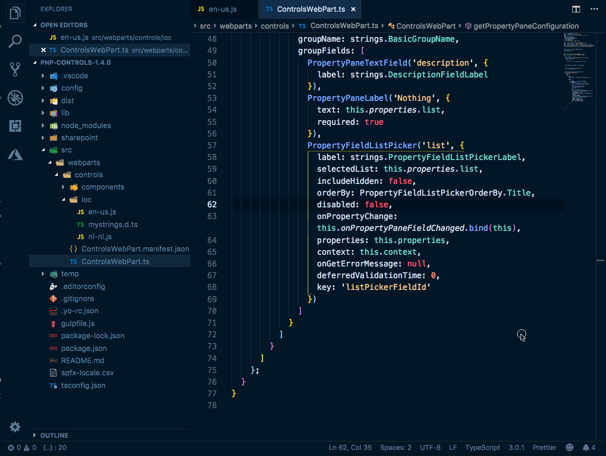

# SharePoint Framework Localization Resources Extension

This extension for Visual Studio Code makes it easier to work with locale resource files in SharePoint Framework projects. The extension has the ability to export all locale labels to a CSV/XLSX file to make translations easier to process. Once the CSV/XLSX file is complete, the data could be imported.

Besides the CSV/XLSX import and export functionality. The extension allows you to quickly add new locale labels, importing the resource dependency reference to your file and showing the locale label values while hovering over their name in code.

## What can this extension do for you?

### Export to CSV file

With the CSV/XLSX export functionality, you can export a single or all known resources to a CSV/XLSX file. The structure of this CSV/XLSX file looks as follows:

```csv
key;Locale <locale>;<Resource key found in config.json>
DescriptionLabel;Description;x
```

If you have multiple resource files and want to use the same key/labels, you can use the value `x` to specify for which resources the key is intended.


### Import from a CSV/XLSX file

Once you exported to a CSV/XLSX file, that file becomes the master. Which means, if you are going to import from the CSV/XLSX file, it will overwrite the already existing `{locale}.js` files in your project.

> If you set the `spfxLocalization.autoCsvExport` setting to `true` (by default it is set to false). The extension will automatically export the labels to the CSV/XLSX file when you create a new label with the `Create new resource key` action.


### Import the resource dependency reference

With the `SPFx import localization strings dependency` action, you can quickly add the resource dependency reference to your file. 


### Creating a new resource key

Creating new resource keys was never easier. Select the text in your code, and use the `SPFx create and insert localization key for selected text` to create and insert the new label to your code.


**What with multiple localized resources?**

When multiple localization resources are available (retrieved from the `config.json` file), it will propose you which one to import or add your keys.


Here is a sample of my `config.json` file:


### Quickly check the resource value

By hovering over the resource value used in your TypeScript or React code, a hover panel appears to show you the known values:



## Extension settings

The extension has the following settings which you can configure to your own preference:

| Setting name | Description | Type | Default value |
| --- | --- | --- | --- |
| `spfxLocalization.csvFileLocation` | The location of the SPFx locale labels CSV/XLSX file. | string | `./spfx-locale.csv` |
| `spfxLocalization.csvDelimiter` | The delimiter to use in the CSV/XLSX file. | string | `;` |
| `spfxLocalization.autoCsvExport` | Specify if you want to automatically export to the CSV/XLSX file when creating new labels. | boolean | `false` |
| `spfxLocalization.localeFileExtension` | Specify the extension type of the localization files. Default is JavaScript, but you can be changed to TypeScript. | enum | "js" \| "ts" |
| `spfxLocalization.csvUseBom` | Use UTF8 BOM marker for CSV/XLSX files. Can be useful on Windows to make UTF8 CSV/XLSX files recognizable by Excel for example. | boolean | `false` |
| `spfxLocalization.csvUseComment` | Enable comment column in CSV/XLSX. You can use this column for notices, such as "translated" or "new". | boolean | `false` |
| `spfxLocalization.csvUseTimestamp` | Auto-fill timestamp column with current timestamp when new strings are added. | boolean | `false` |


## How to use this extension

### Export to CSV/XLSX

- Start by opening the command prompt:
  - Windows `⇧+ctrl+P`
  - Mac: `⇧+⌘+P`
- Type: `SPFx export locale labels to CSV/XLSX` and press `enter`
- Select for which resource(s) you want to start the export

### Import from CSV/XLSX

- Start by opening the command prompt:
  - Windows `⇧+ctrl+P`
  - Mac: `⇧+⌘+P`
- Type: `SPFx import locale labels from CSV/XLSX` and press `enter`
- Select for which resource(s) you want to start the import

### Import resource module to the current file

- Right-click in the editor
- Click on `SPFx import localization strings module` 
- Select the localized resource to import (if multiple are available, otherwise it will take the first one)

OR

- Start by opening the command prompt:
  - Windows `⇧+ctrl+P`
  - Mac: `⇧+⌘+P`
- Type: `SPFx import localization strings module` and press `enter`
- Select the localized resource to import (if multiple are available, otherwise it will take the first one)

### Create a new locale label

- Right-click in the editor
- Click on `SPFx create localization key`
- Provide the name of the key to create
- Provide the value for the locale label
- Select the localized resource to where the label will be created

OR

- Start by selecting some text in your code
- Open the command prompt:
  - Windows `⇧+ctrl+P`
  - Mac: `⇧+⌘+P`
- Type: `SPFx create localization key` and press `enter`
- Provide the name of the key to create
- Provide the value for the locale label
- Select the localized resource to where the label will be created

### Create a new locale label by selecting text

- Start by selecting some text in your code
- Right-click in the editor
- Click on `SPFx create and insert localization key for selected text`
- Provide the name of the key to create
- Select the localized resource to where the label will be created

OR

- Start by selecting some text in your code
- Open the command prompt:
  - Windows `⇧+ctrl+P`
  - Mac: `⇧+⌘+P`
- Type: `SPFx create and insert localization key for selected text` and press `enter`
- Provide the name of the key to create
- Select the localized resource to where the label will be created

### Editor context menu

All the actions are also available from the editor its context menu.


When you select text, the `add and insert` action becomes available:


## Feedback and snippet ideas

Feedback and ideas are always welcome. Please submit them via creating an issue in the project repository: [issue list](https://github.com/estruyf/vscode-spfx-localization/issues).